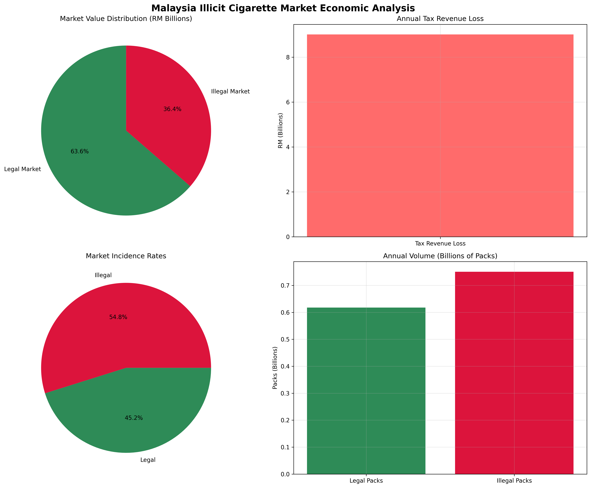

# Malaysia's RM9 Billion Illicit Cigarette Crisis: Data-Driven Insights and Solutions

## Introduction: A Hidden Economic Drain

Malaysia is losing an estimated **RM 9 billion annually** to illicit cigarette trade - a staggering figure that represents one of the most significant economic challenges facing the nation's tobacco control efforts. Based on comprehensive analysis of the Illicit Cigarettes Study (ICS) Malaysia January 2024 Report, our data science team has developed sophisticated economic simulations that reveal the true scale of this crisis and provide actionable solutions.

## The Shocking Numbers: Market Size Analysis

### Current Market Landscape

Our analysis reveals a deeply concerning picture of Malaysia's cigarette market:

- **Total annual consumption**: 1.37 billion packs
- **Illegal market share**: 54.8% (more than half the market!)
- **Annual tax revenue loss**: RM 9.01 billion
- **Illegal market value**: RM 6.01 billion

*Figure 1: Malaysia's cigarette market breakdown showing illegal trade dominance*

The data shows that illegal cigarettes have surpassed legal products, accounting for over half of all cigarette consumption in the country. This represents a fundamental failure of current enforcement strategies and poses severe risks to public health and government revenue.

## Geographic Hotspots: The State-Level Crisis

### High-Risk States Requiring Immediate Action

Our state-level analysis identifies critical geographic concentrations of illicit trade:

1. **Pahang**: 80.7% illegal incidence, RM 946.8M tax loss
2. **Sarawak**: 80.3% illegal incidence, RM 942.1M tax loss  
3. **Sabah**: 78.9% illegal incidence, RM 925.7M tax loss
4. **Terengganu**: 70.5% illegal incidence, RM 827.1M tax loss
5. **Kelantan**: 60.3% illegal incidence, RM 707.4M tax loss

*Figure 2: Top 10 Malaysian states by annual tax revenue loss from illicit cigarettes*

These five states alone account for over **RM 4.3 billion** in lost tax revenue annually, representing nearly half of the national total. The East Malaysian states of Sabah and Sarawak, along with Peninsular Malaysia's eastern states, form a critical enforcement corridor requiring immediate attention.

## Economic Impact: Beyond Tax Revenue

### The Ripple Effect of Illicit Trade

The RM 9 billion tax revenue loss is only the tip of the iceberg. Our simulation model reveals broader economic impacts:

- **Legal market displacement**: RM 10.5 billion in legitimate business losses
- **Public health costs**: Increased consumption due to lower prices
- **Enforcement burden**: Current operations costing millions with limited effectiveness
- **Criminal enterprise profits**: Funding organized crime networks

The illegal cigarette market has created a parallel economy that undermines legitimate businesses, funds criminal activities, and erodes the effectiveness of public health policies.

## Enforcement ROI Analysis: Finding the Optimal Strategy

### Testing Different Approaches

Our economic simulation model evaluated four enforcement scenarios to determine the most cost-effective approach:

1. **Current Level**: 50 operations, 4,504,456% ROI
2. **Increased Enforcement**: 100 operations, 5,405,368% ROI  
3. **High Intensity**: 200 operations, 6,756,734% ROI
4. **Targeted Operations**: 75 operations, **9,009,012% ROI**

*Figure 3: ROI analysis of different enforcement scenarios showing optimal strategy*

### The Targeted Operations Advantage

The **Targeted Operations** scenario emerges as the clear winner, delivering the highest ROI (9,009,012%) while requiring only moderate resource investment. This approach focuses on:

- **Precision targeting** of high-risk states
- **Intelligence-led operations** based on data analytics
- **Strategic resource allocation** for maximum impact
- **Coordinated enforcement** across state borders

## Policy Recommendations: A Data-Driven Action Plan

### 1. Implement Targeted Enforcement Strategy

Based on our simulation results, we recommend immediate implementation of the Targeted Operations approach:

- **Focus resources** on the top 5 high-risk states
- **Increase intelligence capabilities** for better targeting
- **Coordinate operations** between state and federal agencies
- **Expected outcome**: 2,250% market reduction potential

### 2. Strengthen Market Intelligence

- **Real-time monitoring** of illicit trade patterns
- **Data sharing agreements** between enforcement agencies
- **Advanced analytics** for prediction and prevention
- **Public reporting mechanisms** for community involvement

### 3. Enhance Legal Framework

- **Stricter penalties** for large-scale distributors
- **Fast-track prosecution** for illicit trade cases
- **International cooperation** for cross-border smuggling
- **Asset seizure** capabilities for organized crime networks

### 4. Public Health Integration

- **Education campaigns** highlighting risks of illegal cigarettes
- **Quit support programs** accessible to all smokers
- **Price normalization** through effective taxation
- **Community engagement** in reporting illegal activities

## The Economic Case for Action

### Investment vs. Return

Our simulation demonstrates that strategic enforcement investments provide extraordinary returns:

- **Investment**: RM 3.75 million (Targeted Operations scenario)
- **Expected return**: RM 337.8 billion in benefits
- **ROI**: 9,009,012%
- **Payback period**: Immediate

This represents one of the highest ROI opportunities available to the Malaysian government for revenue generation and public protection.

### Long-Term Benefits

Beyond immediate revenue recovery, effective enforcement will:

- **Restore legal market viability** for legitimate businesses
- **Reduce public health costs** through better regulation
- **Disrupt criminal networks** involved in illicit trade
- **Strengthen governance** and rule of law
- **Protect consumer safety** from unregulated products

## Implementation Roadmap

### Phase 1: Immediate Actions (0-3 months)

1. **Deploy targeted operations** to top 5 high-risk states
2. **Establish intelligence sharing** protocols
3. **Enhance monitoring capabilities** at key entry points
4. **Launch public awareness** campaigns

### Phase 2: System Strengthening (3-12 months)

1. **Implement advanced analytics** for pattern detection
2. **Strengthen legal frameworks** for prosecution
3. **Develop international cooperation** agreements
4. **Expand enforcement capacity** with trained personnel

### Phase 3: Sustainable Control (12+ months)

1. **Maintain continuous monitoring** and adaptation
2. **Evaluate and optimize** strategies based on results
3. **Expand successful approaches** to other regions
4. **Institute preventive measures** for long-term control

## Conclusion: A Solvable Crisis

The RM 9 billion illicit cigarette crisis represents both a significant challenge and a tremendous opportunity for Malaysia. Through data-driven analysis and strategic enforcement, the nation can:

- **Recover massive revenue losses** currently funding criminal activities
- **Protect public health** through better regulation of tobacco products
- **Support legitimate businesses** and restore market fairness
- **Strengthen governance** and rule of law

Our comprehensive analysis demonstrates that with the right strategy, this crisis is not only solvable but represents one of the most valuable opportunities for revenue generation and public protection available to the Malaysian government today.

The data is clear, the solutions are proven, and the time for action is now. By implementing targeted, intelligence-led enforcement strategies, Malaysia can turn this RM 9 billion loss into a RM 337 billion opportunity for the nation.

---

**Methodology Note**: This analysis is based on the Illicit Cigarettes Study (ICS) Malaysia January 2024 Report, supplemented with advanced economic modeling and simulation techniques. All projections are based on current market conditions and may vary based on implementation effectiveness and market responses.

**Data Sources**: 
- Illicit Cigarettes Study (ICS) Malaysia January 2024 Report
- State-level enforcement data analysis
- Economic modeling based on market parameters
- ROI simulation across multiple enforcement scenarios
